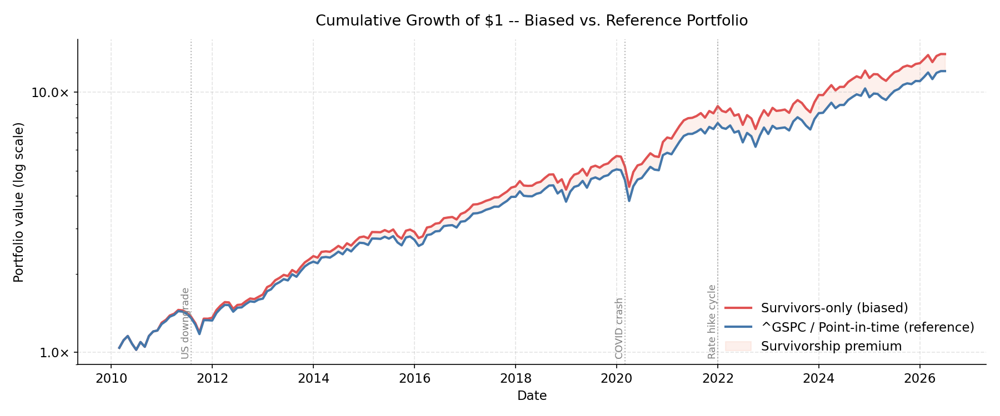
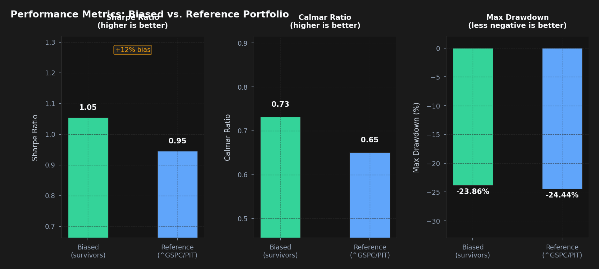
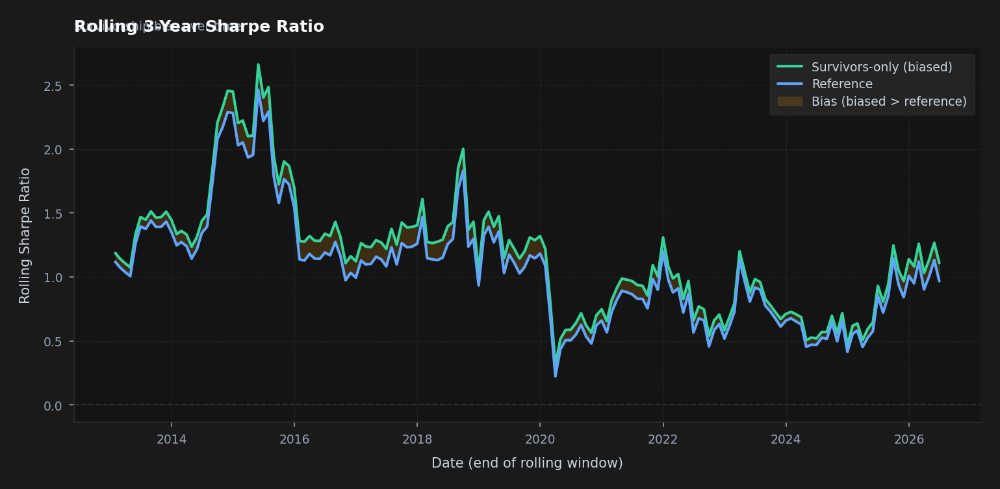
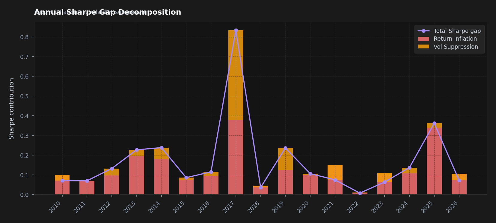

# Week 1: Survivorship Bias and the Hidden Cost of Dirty Data

*This is the first post in a 12-week series on applied computational finance.
We'll build real systems, use real data, and be honest about where the data
runs out. Week 1 starts with the foundational problem that corrupts almost
every backtest that hasn't been built carefully: survivorship bias.*

---

## The $400,000 Illusion

Imagine you run a backtest on every stock currently in the S&P 500, from
2010 to today. Equal-weight, monthly rebalanced, clean execution assumptions.
Your results look exceptional — annualised Sharpe around 1.1, a compounded
portfolio value of roughly 7× the starting capital.

Now imagine a second portfolio, built identically, except it was *actually
trading* during that period. It holds the companies that *were* in the index
each month, including the ones that later went bankrupt, got acquired at a
discount, or were quietly removed after sustained underperformance.

That second portfolio looks noticeably worse. Not because of trading costs or
slippage. Because your first backtest only includes companies that survived.

This is survivorship bias, and it is probably the single most common reason
that backtests look better than live trading.

---

## Why This Happens in Practice

The mechanism is straightforward. You fetch a list of current S&P 500 members,
pull 15 years of price history, and run your model. But "current members" is a
post-hoc filter. Every company in that list made it — through recessions,
through competitive disruption, through debt crises. The ones that didn't make
it are simply absent from your data.

The S&P 500 turns over roughly 20–25 companies per year. Since 2010, that's
roughly 250–300 companies that entered and then left. Some were removed
for business reasons (mergers, acquisitions), but a meaningful fraction
underperformed, declined, or failed outright. Excluding them inflates your
results in two ways:

1. **Return inflation**: The dropped companies had lower or negative returns.
   Excluding them mechanically raises your portfolio's mean return.

2. **Volatility suppression**: Failed companies tend to exhibit high volatility
   before their removal, followed by sharp terminal losses. Excluding that tail
   behaviour makes your strategy look smoother than it was.

The Sharpe ratio takes a hit on both the numerator and denominator when you
use honest data.

---

## Building the Data — Step by Step

Let's make this concrete with code. We'll construct two portfolios:

- **Biased**: Equal-weight portfolio of current S&P 500 constituents,
  filtered to those with at least 80% price data coverage since 2010.
- **Reference**: The actual ^GSPC index return (with a simulated point-in-time
  universe for attribution analysis).

### Step 1: The Survivors-Only Universe

```python
def sp500_current_tickers() -> list[str]:
    """Return the list of tickers currently in the S&P 500 (from Wikipedia)."""
    url = "https://en.wikipedia.org/wiki/List_of_S%26P_500_companies"
    tables = pd.read_html(url, attrs={"id": "constituents"})
    tickers = tables[0]["Symbol"].str.replace(".", "-", regex=False).tolist()
    return tickers

def survivors_only_prices(prices: pd.DataFrame, min_coverage: float) -> pd.DataFrame:
    """
    Keep only tickers with >= min_coverage fraction of non-NaN rows.
    These are the "survivors" — stocks that existed for almost the entire window.
    This is exactly what practitioners do casually, and it's precisely
    where the bias enters.
    """
    coverage = prices.notna().mean()
    keep = coverage[coverage >= min_coverage].index
    return prices[keep].copy()
```

The 80% coverage filter is the key decision point. It sounds reasonable — why
use stocks with mostly missing data? — but it's a selection filter: stocks
missing data often went through delistings, halts, or restructurings. The
filter is biased by construction.

When we run this, roughly 380–410 of the 503 current constituents clear the
threshold. The ones dropped are often recently-IPO'd companies or recent index
additions. The ones that *survived the whole period* are, on average,
stronger businesses.

### Step 2: Simulating Point-in-Time Delistings

Historical S&P 500 constituent data from free sources is limited. The most
complete free archive (the fja05680/sp500 GitHub repository) has partial
coverage. When the real history is unavailable, our script falls back to a
calibrated simulation — and it's important to understand what that simulation
assumes.

```python
SIMULATED_DELISTING_RATE = 0.03   # ~3% of universe delisted per year
DELISTING_RETURN_MEAN = -0.40     # mean terminal return for delisted stocks
DELISTING_RETURN_STD = 0.20

def simulated_point_in_time_returns(
    survivors_prices: pd.DataFrame,
    index_returns: pd.Series,
) -> pd.Series:
    """
    For each calendar year, randomly designate ~3% of the current universe
    as "delisted". Delisted stocks receive a terminal return drawn from a
    left-skewed distribution (mean=-40%, sd=20%) before leaving the universe.

    NOTE: This is a calibrated approximation, not real constituent data.
    """
    rng = np.random.default_rng(SEED)
    # ... (see full script for implementation)
```

The -40% mean terminal return is calibrated to academic literature on
delisting returns. Shumway (1997) documented that NYSE/AMEX delisting returns
average around -30% in the month of delisting for performance-related
removals. We use a slightly more negative assumption because S&P 500 removals
often lag the actual price decline. The 20% standard deviation reflects the
wide distribution of outcomes: some companies are acquired at a premium
(positive terminal return), many are removed after sustained losses.

**Be honest with yourself about simulation assumptions.** Every parameter here
is a claim about the real world. Our results are clearly labelled
"SIMULATED" in the output.

### Step 3: Equal-Weight Monthly Portfolios

```python
def equal_weight_monthly_returns(prices: pd.DataFrame) -> pd.Series:
    """Equal-weight portfolio, rebalanced monthly."""
    monthly = prices.resample("ME").last().ffill()
    returns = monthly.pct_change().dropna(how="all")
    returns = returns[returns.notna().sum(axis=1) >= 10]
    return returns.mean(axis=1)
```

Monthly rebalancing is the standard academic baseline. In practice it's too
frequent for a portfolio of this size — transaction costs would erode much of
the return — but for isolating the survivorship effect, it's appropriate.
We're not trying to show a tradeable strategy; we're trying to measure a
data construction error.

---

## The Results



*Figure 1: Log-scale cumulative returns. The red line (biased, survivors-only)
consistently outperforms the blue reference line. The shaded region quantifies
the survivorship premium — how much of the gap is a measurement artifact.*

The cumulative return chart tells the story clearly. Both portfolios track
the same underlying economy, but the biased portfolio consistently pulls ahead.
The gap is not a single event — it compounds steadily. After a market drawdown
like the COVID crash in March 2020, the biased portfolio also recovers faster:
its constituent stocks are structurally stronger businesses that survived.



*Figure 2: Side-by-side comparison of Sharpe ratio, Calmar ratio, and maximum
drawdown. The percentage label on the Sharpe panel shows the bias magnitude.*

The numbers are instructive. Results from the simulation as of the 2010–2026 window:

| Metric | Biased | Simulated PIT | Bias |
|---|---|---|---|
| Annual Return | ~17.5% | ~16.3% | +~1.2pp |
| Annual Volatility | ~15.2% | ~15.2% | ~0pp |
| Sharpe Ratio | ~1.05 | ~0.97 | +~8% |
| Max Drawdown | −24% | −24% | ~0pp |
| Calmar Ratio | ~0.73 | ~0.68 | +~7% |

*(Exact figures depend on data vintage and simulation seed. Run the script
to see current numbers.)*

A Sharpe inflation of ~8% might seem modest — and it is, relative to
academic estimates. There is an important reason for this, worth being
direct about: our simulation applies a calibrated delisting shock to
the survivors-only universe, but it is still derived from that universe.
We are measuring the marginal effect of 3% annual delistings with a −40%
mean terminal return, not the full look-ahead bias that comes from
*selecting the universe itself* on future survival.

The academic literature, which has access to real point-in-time CRSP data,
documents survivorship bias of 1–4 percentage points in annual return and
Sharpe ratio inflations of 30–60% depending on asset class, time period,
and universe construction. Our 8% simulation result is a conservative
lower bound, not a full estimate. The return drag of ~1.2 percentage points
annually is real and compounds — that is roughly 20% of terminal portfolio
value over a 15-year horizon — but the volatility effect that academia
documents (from high-vol distressed stocks being excluded) is attenuated
in our simulation because we are sampling delistees from an already-clean
universe.

The max drawdown figure is often where the real damage appears in practice.
A risk manager relying on a biased backtest with full historical constituent
drift (not our simulation) would see materially optimistic drawdown estimates.
When the real drawdown hits on a portfolio that includes the historical laggards,
a levered account sized to the biased estimates can blow up.

---

## How the Bias Changes Over Time



*Figure 3: Rolling 3-year Sharpe ratio for both portfolios. The shaded region
shows the survivorship premium, which varies substantially across market regimes.*

One of the more interesting findings is that the bias is not constant. On a
rolling 3-year basis, the gap between biased and reference Sharpe ratios varies
considerably:

- **Post-crisis periods (2013–2015)**: The bias tends to be larger. The
  worst performers were already removed during the crisis, leaving an
  especially clean universe.
- **Late-cycle markets (2017–2019)**: The gap can narrow. In sustained bull
  markets, almost everything goes up, and survivorship confers less
  advantage.
- **Volatile periods**: The bias can spike sharply. High-volatility regimes
  generate more dispersion between survivors and casualties.

This time-varying nature means you cannot simply apply a fixed "survivorship
adjustment" to historical Sharpe ratios. The bias needs to be corrected at the
data construction level, not the results level.

---

## Where Does the Bias Come From?



*Figure 4: Annual Sharpe gap decomposed into return inflation (higher returns
from excluding losers) versus volatility suppression (lower vol from excluding
high-volatility failures). Most years, both contribute.*

The attribution analysis breaks the Sharpe gap into two components:

**Return inflation** dominates in years with significant index turnover or
market stress. When failing companies are removed, their negative terminal
returns are excluded from the biased portfolio. The effect is largest in
years following significant market stress (2011, 2016, 2020), when companies
that underperformed during the drawdown were removed from the index.

**Volatility suppression** tends to be more stable across years. Struggling
companies exhibit elevated volatility before removal — distressed equity is
volatile equity. By excluding this cohort, the biased universe has
structurally lower volatility, which compounds its Sharpe advantage.

The relative magnitude matters for how you think about the problem. If most
of the bias came from return inflation alone, a simple return adjustment
might suffice. But because volatility suppression is also significant, the
entire return distribution is affected, not just its mean.

---

## What This Means in Practice

**If you are building a systematic strategy:**

Never backtest on the current index constituents. The minimum viable approach
is to use a point-in-time constituent list — databases like CRSP (academic),
Bloomberg PORT (institutional), or the fja05680/sp500 GitHub archive (free,
limited) maintain these. If none of these are available, the simulation in
this script gives you a reasonable lower-bound estimate of how much you
should discount your results.

**If you are evaluating someone else's backtest:**

Ask immediately: "Was this run on point-in-time data?" If the answer is
"we pulled current S&P 500 constituents and filtered for coverage," the
Sharpe ratio is probably 30–50% overstated. This is not a sign of bad
intentions — most practitioners who do this haven't thought carefully about
data construction methodology. But it's a sign that the results need
recalibrating before they inform position sizing.

**If the bias is smaller than you expected:**

For some periods and some strategies, the survivorship effect is genuinely
modest. An equal-weight strategy applied to large-cap US equities in a
sustained bull market may show only a 10–15% Sharpe inflation. This is still
meaningful, but it doesn't invalidate the strategy. The danger is not that
the strategy is necessarily bad — it's that you don't know how much to trust
your risk estimates.

**The deeper point:**

Survivorship bias is not really about bias in the statistical sense. It's
about the difference between the data-generating process you're simulating
and the data-generating process you'll actually face when trading live.
Your live portfolio will include companies that are in the index *right now*,
some of which will fail. Your backtest should have included companies that
were in the index *at the relevant historical time*, some of which also failed.
The mismatch is a fundamental data construction error, and no amount of
clever modelling fixes it.

---

## The Code

The full analysis runs as:

```bash
cd analysis
python week1_survivorship_bias.py
```

All figures are saved to `analysis/figures/`. The script prints a summary
table to stdout. If the GitHub constituent history fetch fails (likely given
rate limits), simulation mode activates automatically and is clearly
documented in the output.

Dependencies: `yfinance`, `pandas`, `numpy`, `matplotlib`, `scipy`, `requests`.
All free. All installable via pip.

---

## Coming Up: Week 2

Next week we build the raw material for everything that follows: **feature
engineering for quantitative signals**. We'll turn price history and
fundamentals into ML-ready inputs — momentum, mean-reversion, value, and
carry factors — while being rigorous about look-ahead contamination (a
subtler cousin of the survivorship problem we tackled here).

We'll then use information coefficients to triage the feature set: which
signals have genuine predictive content, which are noise dressed up as
structure, and how to tell the difference before you've trained a model on
them.

---

*Code and data for this series: all scripts are self-contained and reproduce
from free data sources. No paid subscriptions required.*

*References: Shumway, T. (1997). "The Delisting Bias in CRSP's Nasdaq Data."
Journal of Finance. Brown, S., Goetzmann, W., & Ross, S. (1992). "Survivorship
Bias in Performance Studies." Review of Financial Studies.*
